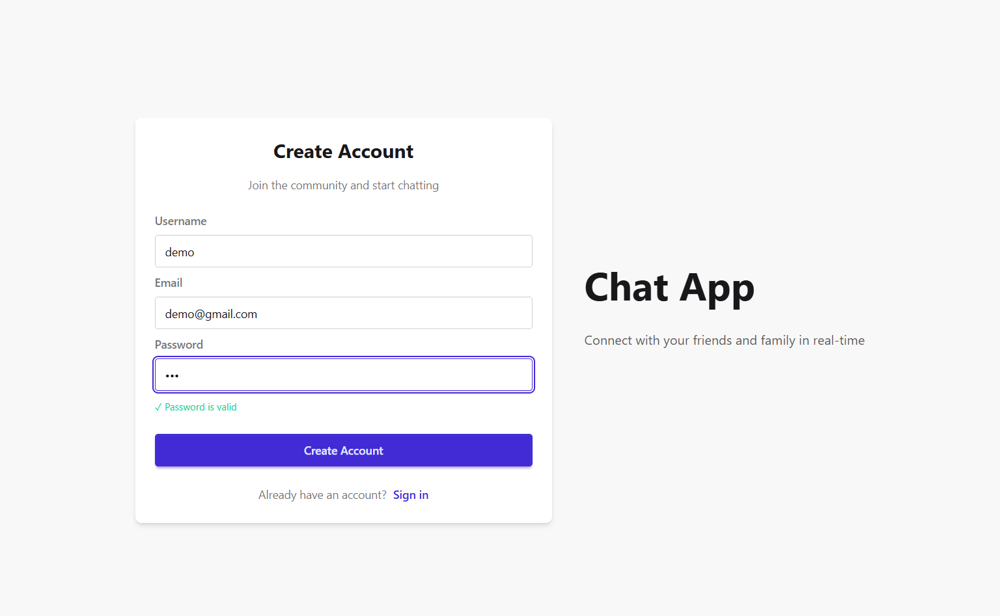
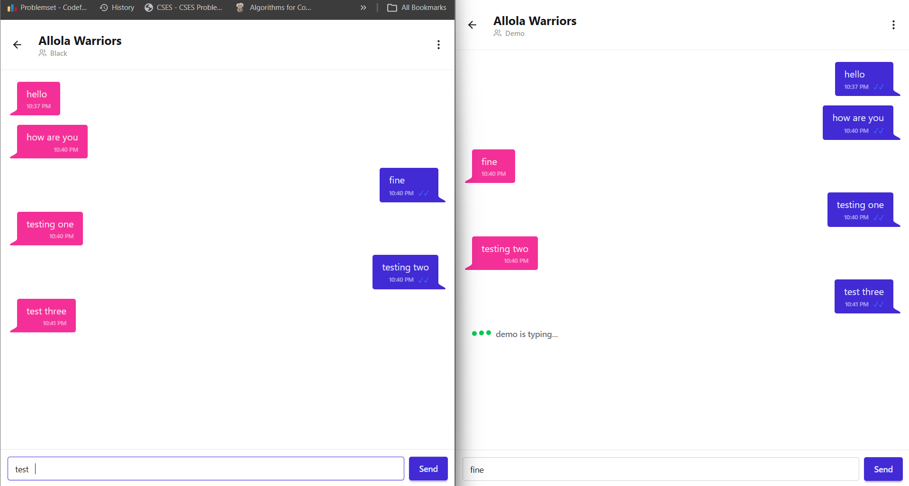
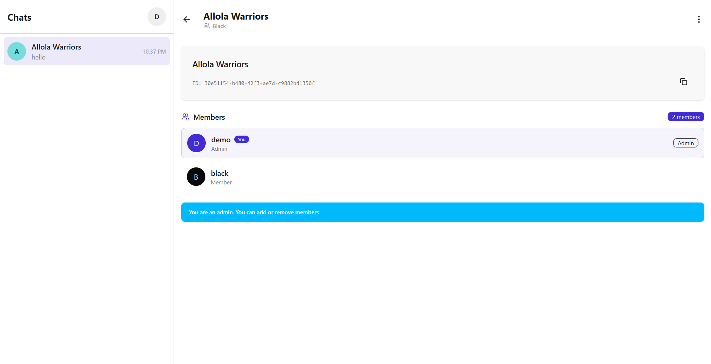
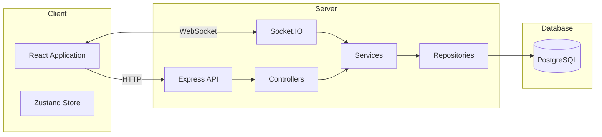
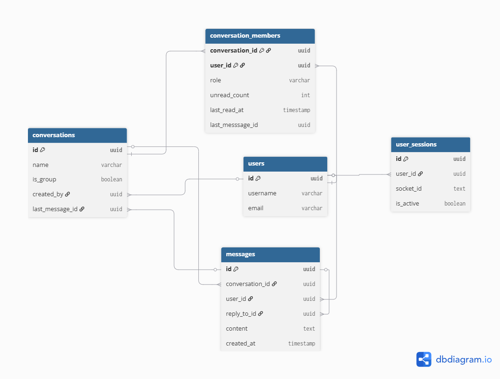
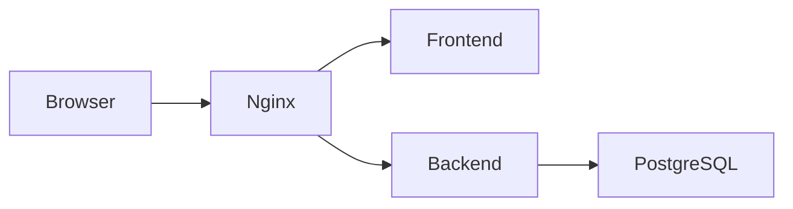

# 💬 ChatApp


**A full-stack real-time chat application built with React, Express, PostgreSQL, and Socket.IO.**

Supports one-to-one and group conversations with real-time messaging, typing indicators, unread message tracking, read receipts, JWT authentication, and a fully Dockerized deployment.

---

## Live Demo

🌐 **Application:** https://chatapp-sigma-murex.vercel.app

> Create two accounts in separate browser windows to experience real-time messaging, typing indicators, unread counts, and read receipts.

---

## Overview

ChatApp is a full-stack real-time messaging application built to explore the architecture and engineering challenges behind modern chat platforms. Rather than focusing only on message exchange, the project implements the supporting systems required to deliver a responsive chat experience—real-time event handling, conversation state management, unread message tracking, read receipts, typing indicators, secure authentication, and persistent user sessions.

The backend follows a layered architecture (**Controller → Service → Repository**) with PostgreSQL as the primary datastore and Socket.IO powering real-time communication. The frontend is built with React and Zustand to keep UI state synchronized with live server events while maintaining a responsive user experience.

---

## Features

### Real-Time Messaging

- One-to-one and group conversations
- Instant message delivery using Socket.IO
- Optimistic UI updates for outgoing messages
- Automatic message synchronization across connected clients

### Conversation Experience

- Live typing indicators
- Read receipts for direct and group chats
- Unread message counters
- Conversation previews with latest message
- Join and leave group conversations

### Authentication & Security

- JWT-based authentication
- Refresh token rotation
- Protected API routes
- Socket authentication middleware
- Automatic session recovery on token refresh

### Backend Architecture

- Layered architecture (Controller → Service → Repository)
- PostgreSQL relational data model
- Database triggers for conversation metadata
- Persistent user session tracking
- REST APIs integrated with Socket.IO events

### Frontend

- Responsive interface built with React
- Zustand for global state management
- Axios interceptors for automatic token refresh
- Component-based architecture
- Mobile-friendly layout

### DevOps

- Fully containerized with Docker
- Nginx reverse proxy
- Multi-container development environment
- Environment-based configuration

---

## Engineering Highlights

Some implementation details that shaped the project:

- Designed a normalized PostgreSQL schema for conversations, memberships, messages, unread counts, and active user sessions.
- Implemented timestamp-based read receipts that support complete and partial reads across group conversations.
- Used Socket.IO rooms to efficiently broadcast conversation-specific events while maintaining separate user channels.
- Leveraged PostgreSQL triggers to automatically maintain conversation metadata and unread message counts.
- Built automatic JWT refresh handling using Axios interceptors to minimize authentication interruptions.
- Organized the backend using a layered architecture to separate routing, business logic, and database access.

---

## Tech Stack

| Layer              | Technologies                                              |
| ------------------ | --------------------------------------------------------- |
| **Frontend**       | React, Vite, Zustand, React Router, Tailwind CSS, DaisyUI |
| **Backend**        | Node.js, Express.js, Socket.IO                            |
| **Database**       | PostgreSQL                                                |
| **Authentication** | JWT, Refresh Tokens, Bcrypt                               |
| **Networking**     | Axios, WebSockets                                         |
| **Deployment**     | Docker, Docker Compose, Nginx                             |

---

## Project Preview

| Login                           | Real-time Chat                           |
| ------------------------------- | ---------------------------------------- |
|  |  |

| Chat                                |
| ----------------------------------- |
|  |

---

## Architecture

The application follows a layered architecture that separates request handling, business logic, persistence, and real-time communication. While REST APIs handle resource management and authentication, Socket.IO is responsible for synchronizing live events between connected clients.



---

## Read Receipts Strategy

Instead of storing a read flag for every message, the application tracks the last message each member has read within a conversation.

```text
conversation_members
├── unread_count
├── last_read_message_id
└── last_read_at
```

A message is considered read when:

```text
last_read_at >= message.created_at
```

This allows the application to support:

- direct message read receipts
- group read receipts
- partially read conversations
- unread message counters

without maintaining separate read records for every individual message.

---

## Database Design

The database is normalized around five primary entities.

### ER Diagram



<!-- ```mermaid
erDiagram

USERS ||--o{ CONVERSATION_MEMBERS : joins
CONVERSATIONS ||--o{ CONVERSATION_MEMBERS : contains
CONVERSATIONS ||--o{ MESSAGES : has
USERS ||--o{ MESSAGES : sends
USERS ||--o{ USER_SESSIONS : owns
``` -->

### Core Tables

| Table                    | Responsibility                           |
| ------------------------ | ---------------------------------------- |
| **users**                | User accounts and authentication         |
| **conversations**        | Chat metadata and latest message         |
| **conversation_members** | Membership, unread counts, read state    |
| **messages**             | Conversation messages                    |
| **user_sessions**        | Active socket sessions and online status |

Several database triggers are used to automatically:

- update conversation previews
- maintain unread message counts
- update read state
- synchronize user presence

This keeps conversation state consistent regardless of where messages originate.

---

## Getting Started

### Prerequisites

Before running the application, ensure the following are installed:

- Git
- Docker
  > **Note:** Make sure Docker Daemon is running. in Linux, run `sudo service docker start`, in Windows, open Docker Desktop.

---

### Clone the Repository

```bash
git clone https://github.com/balaji7416/chatapp
cd chatapp
```

---

### Environment Variables

Create the required environment files from the provided examples, `or use the defaults`.

```bash
cp backend/.env.example backend/.env
cp frontend/.env.example frontend/.env
```

---

### Running the Application

Build and start every service:

```bash
docker compose up --build
```

Run in detached mode:

```bash
docker compose up -d --build
```

Stop all services:

```bash
docker compose down
```

View logs:

```bash
docker compose logs -f
```

Once the containers are running:

- Frontend → `http://localhost`
- Backend API → `http://localhost/api`

---

## Docker Architecture

The application is composed of four containers.



## Services

| Service        | Responsibility                               |
| -------------- | -------------------------------------------- |
| **Frontend**   | React application                            |
| **Backend**    | REST API & Socket.IO server                  |
| **PostgreSQL** | Persistent data storage                      |
| **Nginx**      | Reverse proxy for HTTP and WebSocket traffic |

- Nginx routes API requests and WebSocket connections to the backend while serving the frontend from a single entry point.

## Future Improvements

The current implementation focuses on the core messaging experience. Features planned for future updates include:

- Reply to messages
- Message editing and deletion
- File and image sharing
- Emoji reactions
- User presence and last seen
- Push notifications
- End-to-end encryption

---

## Author

**Ramala Karthik**

GitHub: **@balaji7416**
